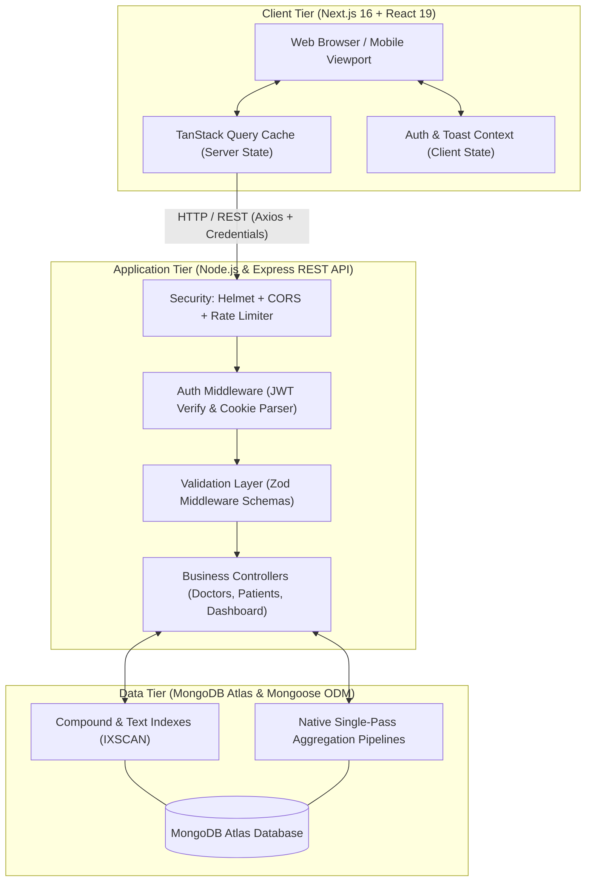
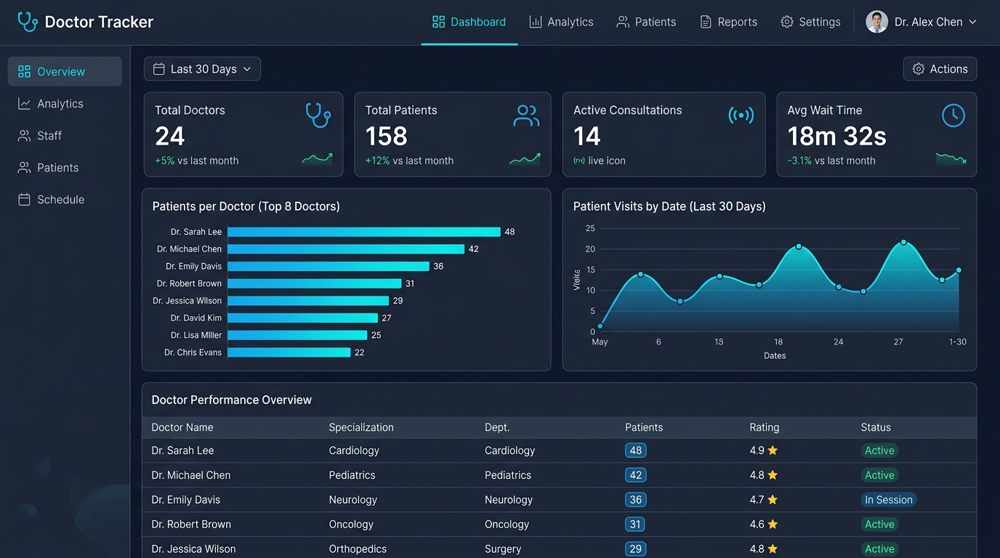
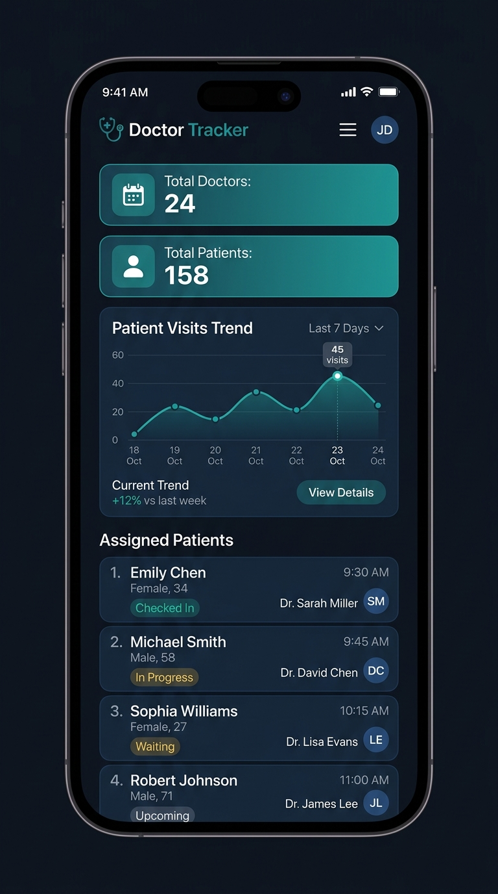

# 🩺 Doctor Tracker — Full-Stack Healthcare Management Platform

Doctor Tracker is a modern, enterprise-ready healthcare platform engineered to streamline clinical administration. It connects medical practitioners, patient records, and operational analytics into a cohesive, high-performance web application.

---

## 📋 Table of Contents
1. [Description](#-description)
2. [Setup Guide](#-setup-guide)
3. [System Architecture](#-system-architecture)
4. [Technical Decisions](#-technical-decisions)
5. [Visual Evidence](#-visual-evidence)
6. [Submission Details](#-submission-details)
7. [Complete API Endpoint Reference](#-complete-api-endpoint-reference)
8. [Postman & API Client Collection](#-postman--api-client-collection)
9. [Database Indexing & Performance Architecture](#-database-indexing--performance-architecture)

---

## 📌 Description

Doctor Tracker is a full-stack, enterprise-grade clinical management and analytics platform engineered to streamline healthcare administration by unifying doctor directory management, patient consultation tracking, and real-time operational reporting into a single intuitive system. Built with a high-performance Node.js/Express REST API, MongoDB Atlas, and a modern Next.js 16/React 19 frontend, the platform empowers medical administrators to perform sub-second indexed searches across complex clinical histories, monitor practitioner workloads via native database aggregation pipelines, and safeguard sensitive health records with JWT authentication and end-to-end schema validation.

---

## 🚀 Setup Guide

Follow this step-by-step guide to install, configure, seed, and run Doctor Tracker locally.

### Prerequisites
- **Node.js**: v20.x (LTS) or higher
- **npm**: v10.x or higher
- **MongoDB**: A running MongoDB Atlas cluster connection URI or local MongoDB instance (v7.x+)

---

### Step 1: Clone the Repository
```bash
git clone https://github.com/your-username/doctor-tracker.git
cd "Doctor Tracker"
```

---

### Step 2: Backend Installation & Environment Setup

1. **Install backend dependencies:**
   ```bash
   npm install
   ```

2. **Configure Backend Environment Variables (`.env`):**
   Create a `.env` file in the root directory by copying `.env.example`:
   ```bash
   cp .env.example .env
   ```
   Then fill in your own real values — **never commit `.env` or share real secrets publicly.**

   **`.env.example` contents (placeholders only):**
   ```env
   PORT=5000
   MONGODB_URI=your-mongodb-atlas-connection-string
   JWT_SECRET=change-me
   JWT_EXPIRES_IN=7d
   FRONTEND_URL=http://localhost:3000
   NODE_ENV=development
   ```

   | Variable | Description | Default / Example |
   |---|---|---|
   | `PORT` | Port for the Express server to listen on | `5000` |
   | `MONGODB_URI` | MongoDB connection string (Atlas or Local) | `mongodb+srv://<user>:<password>@cluster.mongodb.net/doctor_tracker` |
   | `JWT_SECRET` | Secret key used to sign and verify JSON Web Tokens (generate a long random string, do not reuse this example) | *(generate your own)* |
   | `JWT_EXPIRES_IN` | Session token expiration duration | `7d` |
   | `FRONTEND_URL` | Allowed CORS origin for Next.js frontend | `http://localhost:3000` |
   | `NODE_ENV` | Application environment mode | `development` |

3. **Seed the Administrator Account:**
   Run the automated seeding script. This creates (or updates) a single admin account using values you control — either edit the seed script's defaults before running it, or pass your own email/password as arguments if the script supports it:
   ```bash
   npm run seed:admin
   ```
   The script will print the credentials it just created to your terminal. **Use those — do not reuse any example credentials from documentation.**

4. **Verify Database Indexes & Query Execution Plans:**
   ```bash
   npm run verify:indexes
   ```
   *Ensures compound indexes and text indexes are active and queries utilize `IXSCAN` / `TEXT_MATCH` instead of costly `COLLSCAN`.*

5. **Start Backend Development Server:**
   ```bash
   npm run dev
   ```
   *Backend starts at `http://localhost:5000`. Health check is available at `http://localhost:5000/api/health`.*

---

### Step 3: Frontend Installation & Environment Setup

1. **Navigate to the frontend directory:**
   ```bash
   cd doctor-tracker-frontend
   ```

2. **Install frontend dependencies:**
   ```bash
   npm install
   ```

3. **Configure Frontend Environment Variables (`.env.local`):**
   Create a `.env.local` file inside `doctor-tracker-frontend/` by copying `.env.local.example`:
   ```bash
   cp .env.local.example .env.local
   ```

   **`.env.local.example` contents:**
   ```env
   NEXT_PUBLIC_API_BASE_URL=http://localhost:5000/api
   ```

   | Variable | Description | Default / Example |
   |---|---|---|
   | `NEXT_PUBLIC_API_BASE_URL` | Base URL of the backend REST API | `http://localhost:5000/api` |

4. **Start Frontend Development Server:**
   ```bash
   npm run dev
   ```
   *Frontend starts at `http://localhost:3000`.*

---

## 🏗️ System Architecture

Doctor Tracker employs a clean, decoupled 3-tier architecture designed for separation of concerns, high throughput, and zero-leakage security boundaries.



### High-Level Data Flow & Service Interactions
1. **Authentication Flow**: When a user logs in, the request passes through `express-rate-limit` (brute-force defense) to `POST /api/auth/login`. Credentials are verified with `bcrypt`. Upon success, a signed JWT is returned in the response body and set as a secure `httpOnly` cookie.
2. **Server State Synchronization**: The Next.js frontend utilizes **TanStack Query (React Query v5)** to query REST endpoints with Axios (`withCredentials: true`). Server responses are cached by deterministic query keys (e.g., `['doctors', filters]`, `['patients', filters]`, `['dashboard']`).
3. **Data Mutation & Cache Invalidation**: When a user creates, updates, or deletes a doctor or patient record:
   - Zod middleware validates request payloads before touching database controllers.
   - On successful mutation, TanStack Query invalidates affected query cache keys concurrently.
   - The UI automatically updates without manual page reloads, accompanied by centralized toast feedback.
4. **Optimized Analytics Processing**: Dashboard metrics bypass heavy server-side iteration and instead execute native single-pass MongoDB aggregation pipelines (`$group`, `$lookup`, `$project`, `$sort`), returning pre-aggregated chart datasets directly to Recharts visualizers.

---

## 🧠 Technical Decisions

### Decision 1: TanStack Query (React Query v5) + React Context over Redux Toolkit
- **Context & Problem:**
  Healthcare management systems balance two different state types: (1) **Asynchronous Server State** (paginated doctor records, filtered patient lists, dynamic dashboard statistics) that requires caching, deduplication, background invalidation, and network refetching; and (2) **Synchronous Client State** (current authenticated user, active toast notifications, modal dialogues). Managing both inside Redux Toolkit creates extensive boilerplate and frequently leads to cache synchronization bugs where client state drifts from the database.
- **Chosen Solution:**
  We paired **TanStack Query (React Query v5)** for server state with **React Context** for lightweight client state:
  - TanStack Query automatically manages caching, query deduplication, background refetching, and granular cache invalidation on mutations (e.g., deleting a patient automatically updates both the global patient list and the doctor's nested patient list).
  - Lightweight React Context (`AuthContext` and `ToastContext`) provides clean, predictable client-side state without redundant global state overhead.
- **Trade-offs & Results:**
  - Eliminated most state boilerplate: no actions, thunks, or reducer files required.
  - Fewer stale-data bugs: mutations invalidate specific query keys directly.
  - Better perceived performance: built-in cached state rendering prevents blank page flickers during navigation.

---

### Decision 2: MongoDB Native Aggregation Pipelines over In-Memory Application Joins
- **Context & Problem:**
  The administrative dashboard requires complex analytical metrics: "Patients per Doctor" (joining doctor records with patient counts and sorting descending) and "Patient Visits by Date" (chronological grouping by day or month). A naive approach would fetch all doctors, loop through them to count patients (`N+1` database queries), or fetch all patient records into Node.js application memory and run JavaScript array operations.
- **Chosen Solution:**
  We implemented **native single-pass MongoDB aggregation pipelines** directly in the database engine:
  ```javascript
  Patient.aggregate([
    { $group: { _id: "$doctor", patientCount: { $sum: 1 } } },
    { $lookup: { from: "doctors", localField: "_id", foreignField: "_id", as: "doctorInfo" } },
    { $unwind: "$doctorInfo" },
    { $project: { _id: 1, name: "$doctorInfo.name", specialization: "$doctorInfo.specialization", patientCount: 1 } },
    { $sort: { patientCount: -1 } }
  ]);
  ```
  In `/api/dashboard/stats-by-date`, date formatting and grouping (`$dateToString` by `%Y-%m-%d` or `%Y-%m`) run within MongoDB.
- **Trade-offs & Results:**
  - Fast response times: database compute leverages internal indexing and RAM caching.
  - Zero N+1 network round-trips: reduced multiple sequential round-trips to exactly one database call per report.
  - Minimal memory footprint: Node.js server heap remains steady regardless of dataset size.

---

## 📸 Visual Evidence

> ⚠️ Add real screenshots to `docs/screenshots/` before publishing, or remove this section. Broken image links look worse than no section at all.

### Desktop Experience

*Desktop analytics dashboard featuring KPI metric cards, a Recharts bar chart (Patients per Doctor), a chronological trend chart (Visits by Date), and the doctor directory table.*

### Mobile Responsive Experience

*Mobile-optimized interface featuring stacked cards, a responsive drawer navigation, and touch-friendly charts.*

---
## 🔑 Submission Details

| Detail | Value / Link |
|---|---|
| **GitHub Repository** | [https://github.com/maruf-ahammed-75/Doctor-Tracker](https://github.com/maruf-ahammed-75/Doctor-Tracker) |
| **Live Frontend** | [https://doctor-tracker-frontend-zeta.vercel.app](https://doctor-tracker-frontend-zeta.vercel.app) |
| **Live Backend API** | [https://doctor-tracker-7y6n.onrender.com/api](https://doctor-tracker-7y6n.onrender.com/api) |
| **Backend REST API (local dev)** | `http://localhost:5000/api` |
| **Frontend Web App (local dev)** | `http://localhost:3000` |
| **Admin Login** | Create your own via `npm run seed:admin` — see Setup Guide Step 2.3. No default credentials are published here. |

> ℹ️ **Note:** The backend runs on Render's free tier, which spins down after inactivity. The first request after idle time may take 30–60 seconds to respond while the server wakes up.
---

## 🔌 Complete API Endpoint Reference

All endpoints except `/api/auth/login` and `/api/health` require authentication via an `httpOnly` cookie (`token`) or `Authorization: Bearer <token>` header.

### 🔐 Authentication (`/api/auth`)
| Method | Endpoint | Description | Auth Required |
|---|---|---|:---:|
| `POST` | `/api/auth/login` | Login with email and password. Returns JWT and sets `httpOnly` cookie (rate limited: 5 req / 15 min). | No |
| `POST` | `/api/auth/logout` | Clears authentication cookie and terminates session. | No |
| `GET` | `/api/auth/me` | Returns current authenticated user profile (password excluded). | **Yes** |

### 🩺 Doctors (`/api/doctors`)
| Method | Endpoint | Description | Auth Required |
|---|---|---|:---:|
| `POST` | `/api/doctors` | Create doctor. Validates email format and uniqueness; auto-attaches creator ID. | **Yes** |
| `GET` | `/api/doctors` | List doctors. Supports `?search=&page=&limit=&from=&to=&specialization=`. | **Yes** |
| `GET` | `/api/doctors/:id` | Retrieve single doctor details by ObjectId, including creator info. | **Yes** |
| `PUT` | `/api/doctors/:id` | Update doctor details. Validates payload and email collision. | **Yes** |
| `DELETE` | `/api/doctors/:id` | Delete doctor document by ObjectId. | **Yes** |
| `GET` | `/api/doctors/:id/patients` | Retrieve paginated patients assigned to this doctor (`?page=&limit=`). | **Yes** |
| `POST` | `/api/doctors/:id/patients` | Create and assign a patient under this doctor (validates doctor exists). | **Yes** |
| `DELETE` | `/api/doctors/:id/patients/:patientId` | Remove patient under doctor (verifies patient belongs to specified doctor). | **Yes** |

### 🧑‍🤝‍🧑 Patients (`/api/patients`)
| Method | Endpoint | Description | Auth Required |
|---|---|---|:---:|
| `GET` | `/api/patients` | Dedicated patient list. Supports `?search=&page=&limit=&condition=&doctorId=&from=&to=`. | **Yes** |
| `GET` | `/api/patients/:id` | Retrieve single patient record with populated doctor details. | **Yes** |
| `PUT` | `/api/patients/:id` | Partially or fully update patient details. | **Yes** |
| `DELETE` | `/api/patients/:id` | Delete patient document by ObjectId. | **Yes** |

### 📊 Dashboard Analytics (`/api/dashboard`)
| Method | Endpoint | Description | Auth Required |
|---|---|---|:---:|
| `GET` | `/api/dashboard/summary` | Returns `{ totalDoctors, totalPatients }` via concurrent database counts. | **Yes** |
| `GET` | `/api/dashboard/patients-per-doctor` | Single aggregation pipeline joining doctor info, sorted by `patientCount` descending. | **Yes** |
| `GET` | `/api/dashboard/stats-by-date` | Aggregation pipeline grouping patient visits chronologically (`?groupBy=day` or `?groupBy=month`). | **Yes** |

### 🛠️ System Health
| Method | Endpoint | Description | Auth Required |
|---|---|---|:---:|
| `GET` | `/api/health` | Health check endpoint returning uptime, status, and MongoDB connection readyState. | No |

---

## 📦 Postman & API Client Collection

Complete Postman collections are included in the [`docs/`](./docs) folder:
- **Collection:** [`docs/DoctorTracker.postman_collection.json`](./docs/DoctorTracker.postman_collection.json)
- **Environment:** [`docs/DoctorTracker.postman_environment.json`](./docs/DoctorTracker.postman_environment.json)

### Import Instructions:
1. Open Postman, click **Import**, and select both files from `docs/`.
2. Select the imported environment (e.g. "DoctorTracker").
3. Send the **Auth > Login** request (`POST {{baseUrl}}/auth/login`) using your own seeded credentials.
4. A built-in test script automatically stores the JWT token into your `{{token}}` variable for all subsequent requests.

---

## ⚡ Database Indexing & Performance Architecture

To reduce latency and avoid collection scans (`COLLSCAN`):

1. **Full-Text Compound Search (`$text`)**:
   - `Doctor`: `{ name: "text", specialization: "text", hospital: "text" }`
   - `Patient`: `{ name: "text", condition: "text" }`
   - Searches use MongoDB's native text indexing with relevance scoring instead of unindexed regex scans.
2. **Compound Filtering Indexes**:
   - `Patient`: compound index `{ doctor: 1, visitDate: -1 }` — accelerates filtering/paginating a doctor's patients by date directly from index RAM.
   - `Doctor`: index `{ createdAt: -1 }` for chronological sorting and date filtering.
3. **Guarded Pagination**:
   - Maximum limit is capped server-side at `100` to prevent excessive memory use from oversized requests.
4. **Execution Plan Verification**:
   - Run `npm run verify:indexes` to print execution stats verifying `IXSCAN` and `TEXT_MATCH` stages on representative queries.
